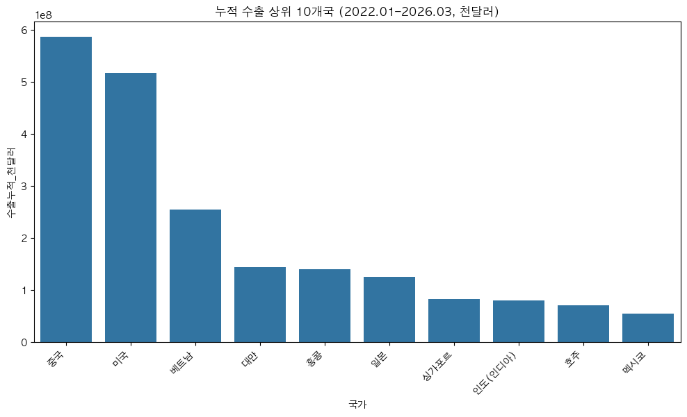
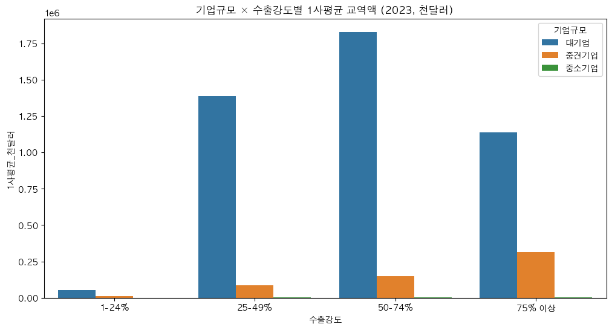
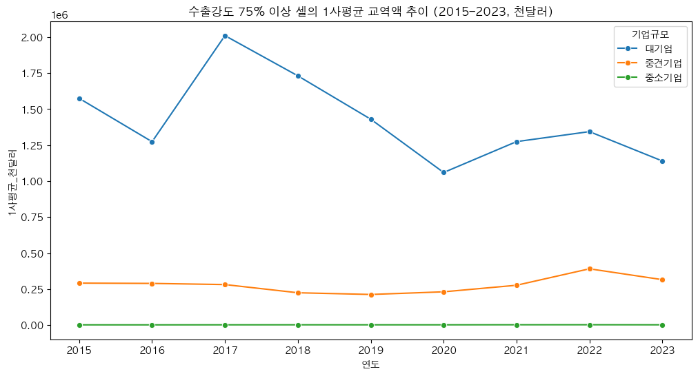
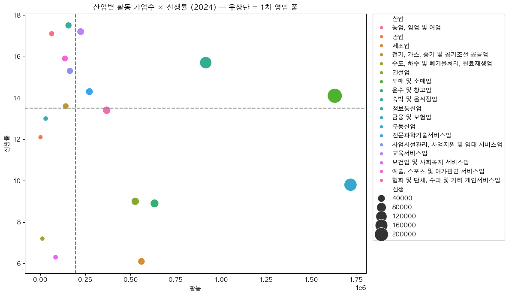
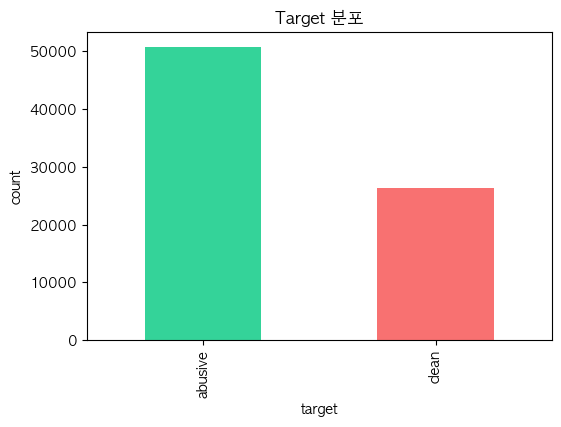
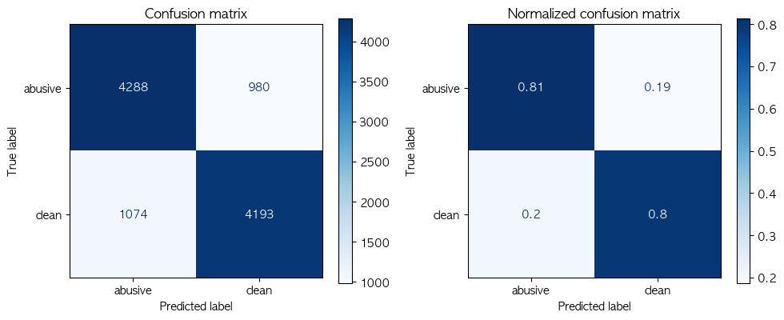
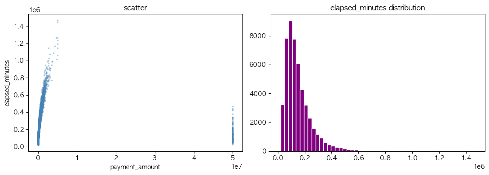
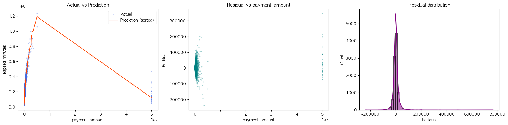

# GlobalGates — AI 발표 자료

> **"피드로 여는 기업용 비즈니스 소셜 마켓"**
> 한국 수출 구조의 다대다 미스매치를 해소하는 B2B 글로벌 판로 플랫폼

---

## 목차

1. [기획 배경 & 의도](#1-기획-배경--의도)
2. [데이터 분석 — KOSIS 4종 데이터 통합 분석](#2-데이터-분석--kosis-4종-데이터-통합-분석)
3. [머신러닝 (분류) — 채팅 욕설 분류기](#3-머신러닝-분류--채팅-욕설-분류기)
4. [머신러닝 (회귀) — 광고 노출 경과 시간 예측](#4-머신러닝-회귀--광고-노출-경과-시간-예측)
5. [머신러닝 (추천) — 커뮤니티 추천 시스템](#5-머신러닝-추천--커뮤니티-추천-시스템)
6. [LLM (RAG) — 화상회의 요약 챗봇](#6-llm-rag--화상회의-요약-챗봇)
7. [LLM (n8n) — 주간 개인화 리포트 자동 발송](#7-llm-n8n--주간-개인화-리포트-자동-발송)

---

## 1. 기획 배경 & 의도

### 한국 수출의 두 겹 양극화

한국 경제는 GDP의 약 **40%를 수출에 의존**하지만, 그 구조 안에는 두 겹의 양극화가 존재한다.

#### ① 기업 규모의 양극화

| 구분 | 비율 | 교역액 점유 |
|---|---|---|
| 중소기업 | 96.1% (93,912개사) | **16.6%** |
| 대기업 | 1.06% | **64.5%** |

- 1사당 평균 교역액 격차: **약 351배**
- 중소기업의 **60.2%가 매출 대비 수출 비중 1–24% 구간**에 9년째 정체

#### ② 시장 분포의 편중

- 상위 10개국 = 전체의 **71.1%**
- 중국·미국 두 나라 = **36.2%** (외생 충격에 취약)
- 그런데 실제 수출국은 **245개**, 연 1억 달러 이상 시장만 **112개**
- 노르웨이(+84.3%), 스위스(+81.6%), 대만(+45.4%), 홍콩(+43.4%) 등 **신흥 시장 102개의 기회 공간은 사실상 비어 있음**

### 본질 문제

> **"가장 많은 수의 중소기업(93,912개)이, 가장 많은 수의 신흥 시장(102개)에 도달하지 못하는 다대다 미스매치"**

이는 생산 역량의 문제가 아니라, **바이어를 만날 채널·시장 정보·신뢰 검증이라는 매개 인프라의 부재**다. KOTRA·해외전시회·무역사절단 같은 기존 채널은 1회성·고비용 모델이라 다대다 매칭을 감당할 수 없다.

### 플랫폼 설계 — 3-Layer 구조

| 레이어 | 역할 |
|---|---|
| **피드 레이어** | 동종 산업 수출 성공 사례·시장 시그널을 일상 노출 → 글로벌 감각 형성 |
| **소셜 그래프 레이어** | 산업·타깃 시장 단위로 바이어와 셀러를 다대다 연결 |
| **마켓 레이어** | 카탈로그·계약·결제 통합 신뢰 인프라로 1회성 거래 장벽 제거 |

### 성공 척도

단순 가입자 수가 아니라,
- 중소기업의 수출강도가 **1–24% → 25–49% 구간**으로 우상향한 비율
- 도달 시장이 **102개 신흥국**으로 확장된 정도

---

## 2. 데이터 분석 — KOSIS 4종 데이터 통합 분석

> **목표**: 기획 배경의 두 양극화(기업 규모·시장 분포)를 **정량 근거로 검증**하고, 플랫폼이 1차로 묶어야 할 셀과 영입 풀을 식별

### 분석 축

| 축 | 데이터 | 기획 배경 매핑 |
|---|---|---|
| 국가 | 국가별 수출입 (2022.01–2026.03) | 시장 분포 편중 검증 |
| 기업규모 × 수출강도 | 2023년 단면 + 2015–2023 시계열 | 기업 규모 양극화 + 1사평균 격차 |
| 산업 | 산업별 활동/신생 (2024) | 다대다 매칭 영입 풀 |

---

### 검증 1. 시장 편중 — 누적 수출 상위 10개국

상위 10개국에 누적 수출이 집중되어 있음을 시각화. **기획 배경의 "상위 10개국 71.1%, 중·미 36.2%" 주장에 대한 정량 근거**.



→ 중국·미국 두 나라가 압도적이며, 그 외 102개 신흥 시장의 기회 공간이 가시화됨.

---

### 검증 2. 기업 규모 양극화 — 1사평균 교역액 격차

```python
size_2023_df = size_long_df[
    (size_long_df["유형"] == "수출")
    & (size_long_df["연도"] == 2023)
    & (size_long_df["기업규모"].isin(["대기업", "중견기업", "중소기업"]))
    & (size_long_df["수출강도"].isin(["1-24%", "25-49%", "50-74%", "75% 이상"]))
].sort_values("1사평균_천달러", ascending=False)
```



→ 1사평균 최상위는 **대기업 50–74% 구간(약 18.3억 천달러)**, 최하위는 **중소기업 1–24% 구간(약 307 천달러)**. 모수는 중소기업 1–24%(56,578개)가 압도적이며 **1사평균 격차는 약 5,964배**. **플랫폼이 묶어줘야 할 가치가 가장 큰 셀.**

**격차의 추세 — 수출강도 75% 이상 셀의 1사평균 추이 (2015–2023)**



→ 같은 "수출 본업 구간"에 있어도 중소기업과 대기업·중견기업의 1사평균 격차가 **시간이 지나도 좁혀지지 않음**. 시장의 자발적 해소가 일어나지 않는다는 증거 → **매개 인프라가 필요한 이유**.

---

### 검증 3. 다대다 매칭 영입 풀 — 산업별 활동 × 신생률

```python
plt.figure(figsize=(12, 7))
sns.scatterplot(
    data=industry_hue_df,
    x="활동", y="신생률",
    hue="산업", size="신생", sizes=(60, 600),
)
plt.axhline(industry_hue_df["신생률"].median(), color="gray", linestyle="--")
plt.axvline(industry_hue_df["활동"].median(), color="gray", linestyle="--")
```



→ 우상단(median 활동 × median 신생률 동시 통과) 산업이 **1차 영입 풀로 가장 두꺼움**. 활동 기업수가 많아 영입 모수가 크고, 신생률이 높아 신규 가입자 유입 가능성도 동시에 큼.

---

### 분석 결론 → 기획 의도와의 연결

1. **시장 편중 검증됨** → 마켓 레이어가 102개 신흥국 판로를 열어야 함
2. **기업 규모 격차 검증됨** → 플랫폼은 **중소기업 1–24% 셀**을 묶어 1사평균 격차를 줄이는 가치 제공
3. **영입 풀 식별** → 우상단 산업(도매·소매, 숙박·음식점, 전문과학기술서비스 등)부터 소셜 그래프 레이어를 채움

---

## 3. 머신러닝 (분류) — 채팅 욕설 분류기

> **목표**: 커뮤니티/채팅 본문의 욕설 여부를 실시간 분류하여 모달/순화 정책에 연결
> **모델**: `CountVectorizer` + `MultinomialNB` (이진 분류)
> **데이터**: PostgreSQL `tbl_ml_profanity_dataset` (77,162행)

**Target 분포 (언더샘플링 전)** — abusive 50,825 / clean 26,337



### 과적합 억제 전략

1. **Kiwi 형태소 + 조사/어미 제거**로 어휘 폭발 차단
2. **StratifiedKFold(5)** — fold 별 클래스 비율 유지
3. **2-stage 튜닝**: RandomizedSearchCV (넓게) → GridSearchCV (좁게)
4. **3-seed 분산 체크** — 점수가 random_state 운빨인지 검증

### 핵심 코드 1 — 한국어 전처리 (Kiwi 조사 제거)

```python
kiwi = Kiwi()
josa_tags = ["JKS","JKC","JKO","JKG","JKB","JKV","JKQ","JX","JC",
             "EC","EF","EP","ETN","ETM"]

def remove_josa(sentence):
    result = []
    for token in kiwi.tokenize(sentence):
        if token.tag in josa_tags:
            continue
        result.append(token.lemma)
    return " ".join(result)
```

**예시**: `"개소리야 니가 빨갱이를 옹호하고..."` → `"개소리 이다 니 빨갱이 옹호 하..."`

### 핵심 코드 2 — 2-stage 튜닝 + 과적합 기준 모델 선택

```python
random_cv = RandomizedSearchCV(
    m_nb_pipe, param_distributions=random_params, n_iter=20,
    cv=skf, scoring=abusive_f1, n_jobs=-1, random_state=124,
)
random_cv.fit(X_train.values, y_train)

# best 주변 ±1 이웃으로 좁혀서 GridSearch
grid_cv = GridSearchCV(m_nb_pipe, param_grid=grid_params,
                      cv=skf, scoring=abusive_f1, n_jobs=-1)
grid_cv.fit(X_train.values, y_train)
```

### 핵심 코드 3 — Gap 기준 최종 모델 선택

```python
MAX_ALLOWED_GAP = 0.10  # train-test gap이 0.10 이내인 후보만 채택

eligible_models = model_compare_df[model_compare_df.gap <= MAX_ALLOWED_GAP]
final_model_row = eligible_models.sort_values(
    ["abusive_f1", "abusive_recall", "gap"],
    ascending=[False, False, True],
).iloc[0]
```

**후보 비교 결과**

| 모델 | train_acc | test_acc | gap | abusive_f1 |
|---|---|---|---|---|
| grid_best (min_df=1) | 0.966 | 0.798 | **0.168** ❌ | 0.806 |
| regularized_min_df2 | 0.894 | **0.805** | **0.089** ✅ | **0.807** |
| regularized_min_df3 | 0.867 | 0.803 | 0.063 ✅ | 0.805 |

→ **min_df=2 (정규화)** 채택. 과적합 억제하면서 abusive F1 유지.

### 3-seed Robustness 결과

| 지표 | 평균 ± std | 판정 |
|---|---|---|
| accuracy | 0.8023 ± 0.0034 | OK |
| precision | 0.7961 ± 0.0034 | OK |
| recall | 0.8128 ± 0.0042 | OK |
| f1 | 0.8043 ± 0.0035 | OK |
| ROC-AUC | 0.8767 ± 0.0020 | OK |

→ **std < 0.005** 모두 통과. 점수가 random_state에 의존하지 않음.

### 운영 threshold 정책 (모델 ≠ 의사결정)

```python
MODAL_THRESHOLD = 0.50    # 이 이상이면 모달로 경고
SOFTEN_THRESHOLD = 0.80   # 이 이상이면 강제 순화

def moderation_action(p_abusive):
    if p_abusive >= SOFTEN_THRESHOLD:
        return "soften_required"
    if p_abusive >= MODAL_THRESHOLD:
        return "show_modal"
    return "allow"
```

### 테스트셋 평가 — Confusion Matrix



- abusive 정밀도 0.7997 / 재현율 0.8140 / F1 0.8068
- clean 정밀도 0.8106 / 재현율 0.7961 / F1 0.8033

### 예측 데모

| 입력 | 예측 | p(abusive) |
|---|---|---|
| "안녕하세요 오늘 날씨 좋네요" | clean | 0.020 |
| "씨발 진짜 짜증나" | abusive | 0.596 |
| "이런 미친 새끼를 봤나" | abusive | **0.992** |
| "fuck this shit" | abusive | **0.992** |
| "장애인 새끼" | abusive | 0.985 |

---

## 4. 머신러닝 (회귀) — 광고 노출 경과 시간 예측

> **목표**: `payment_amount` (광고 결제 금액)으로 `elapsed_minutes` (노출 경과 시간) 예측
> **목적**: 광고주가 결제 시점에 노출 기간을 알 수 있도록
> **데이터**: 50,500행 / 1개 feature (정밀도 우선)

**EDA — payment_amount vs elapsed_minutes 산점도 & 타겟 분포**



→ 결제 금액과 노출 시간 사이에 강한 비선형 양의 상관(로그변환이 필요한 형태).

### 설계 원칙 — 핵심 포인트

| Priority | 포인트 |
|---|---|
| P1 | split **먼저** → 전처리는 Pipeline 안에서 train에만 fit (data leakage 차단) |
| P1 | 타겟 기반 IQR 필터링 제거 (production-valid 평가) |
| P1 | GridSearch scoring을 **RMSLE 기반**으로 통일 (objective 일치) |
| P2 | `TransformedTargetRegressor`로 log1p 변환 **일원화** |

### 핵심 코드 1 — Pipeline 일원화 (전처리 + 타겟 변환)

```python
def make_pipeline(model, scale=False):
    """median imputer + (선택적) scaler + 모델 + log1p 타겟 변환"""
    steps = [('impute', SimpleImputer(strategy='median'))]
    if scale:
        steps.append(('scale', StandardScaler()))
    steps.append(('model', model))
    inner = Pipeline(steps)
    return TransformedTargetRegressor(
        regressor=inner, func=np.log1p, inverse_func=np.expm1,
        check_inverse=False,
    )
```

### 핵심 코드 2 — 6개 모델 베이스라인 CV (RMSLE 기준)

```python
candidates = {
    'LinearRegression':          make_pipeline(LinearRegression(), scale=True),
    'DecisionTreeRegressor':     make_pipeline(DecisionTreeRegressor(...)),
    'RandomForestRegressor':     make_pipeline(RandomForestRegressor(...)),
    'GradientBoostingRegressor': make_pipeline(GradientBoostingRegressor(...)),
    'XGBRegressor':              make_pipeline(XGBRegressor(...)),
    'LGBMRegressor':             make_pipeline(LGBMRegressor(...)),
}

for name, est in candidates.items():
    neg_msle = cross_val_score(est, X_train, y_train, cv=3,
                                scoring='neg_mean_squared_log_error', n_jobs=-1)
    fold_rmsle = np.sqrt(-neg_msle)
```

**CV 결과 (RMSLE, 낮을수록 좋음)**

| 모델 | CV RMSLE |
|---|---|
| **GradientBoosting** | **0.1367** ⭐ |
| RandomForest | 0.1368 |
| XGBoost | 0.1370 |
| LGBM | 0.1431 |
| DecisionTree | 0.1537 |
| LinearRegression | 0.6106 |

### 핵심 코드 3 — RandomForest GridSearch + 최종 평가

```python
param_grid = {
    'regressor__model__n_estimators':    [120, 200, 300],
    'regressor__model__max_depth':       [6, 8],
    'regressor__model__min_samples_leaf':[3, 5, 10],
}

grid_rf = GridSearchCV(
    rf_pipe, param_grid=param_grid,
    scoring='neg_mean_squared_log_error',  # objective = RMSLE
    cv=3, n_jobs=-1,
)
grid_rf.fit(X_train, y_train)
```

### 최종 성능 (Locked Test Set, 1회 평가)

| Metric | Value |
|---|---|
| **R²** | **0.9465** |
| RMSE | 23,299.89 분 |
| RMSLE | 0.1305 |
| MAE | 12,995.75 분 |

→ R² ≈ 0.95로 단일 feature 회귀에서도 강한 예측력 확보.

**잔차 진단 — Actual vs Prediction / Residual vs payment_amount / Residual 분포**



- 좌: 정렬된 예측선이 실제 분포를 잘 따라감 (꼬리 구간만 외삽 한계)
- 중: 잔차가 0 주변에 대칭적으로 분포 (편향 없음)
- 우: 잔차 분포가 0을 중심으로 좁고 뾰족 → 대부분의 예측이 실제와 근접

---

## 5. 머신러닝 (추천) — 커뮤니티 추천 시스템

> **목표**: 사용자가 어떤 커뮤니티에 가입하면, **제목·태그·설명** 기반으로 비슷한 커뮤니티 Top-N 추천
> **방법**: CountVectorizer / TfidfVectorizer + Cosine Similarity
> **데이터**: `tbl_community_dataset` (시드 119건 + 템플릿 증강 → 총 320건, 41개 카테고리)

### 핵심 코드 1 — 문서 결합 + Kiwi 전처리

```python
pre_df = (
    df['community_name'].fillna('') + ' ' +
    df['tags'].fillna('').str.replace(',', ' ') + ' ' +
    df['description'].fillna('')
).to_frame('contents')

# 형태소 분석으로 조사 제거 → 의미 단위 매칭 강화
pre_df['contents_kiwi'] = pre_df['contents'].apply(remove_josa)
```

### 핵심 코드 2 — TF-IDF + 코사인 유사도

```python
from sklearn.feature_extraction.text import TfidfVectorizer
from sklearn.metrics.pairwise import cosine_similarity

tfidf_v = TfidfVectorizer()
tfidf_matrix = tfidf_v.fit_transform(pre_df['contents_kiwi'])
cosine_tfidf = cosine_similarity(tfidf_matrix)
# tfidf_matrix: (320, V),  cosine_tfidf: (320, 320)
```

### 핵심 코드 3 — Top-N 추천 함수

```python
def recommend_similar_communities(community_id, top_n=5, method='tfidf'):
    sim_matrix = cosine_tfidf if method == 'tfidf' else cosine_count
    idx = df.index[df['id'] == community_id][0]
    sims = sim_matrix[idx]

    # 자기 자신 제외 후 Top-N
    order = np.argsort(sims)[::-1]
    order = [i for i in order if i != idx][:top_n]

    result = df.iloc[order][['id', 'community_name', 'tags', 'category_id']].copy()
    result['similarity'] = sims[order].round(4)
    result['category'] = result['category_id'].map(CATEGORY_NAMES)
    return result.reset_index(drop=True)
```

### CountVectorizer vs TfidfVectorizer

| 방식 | 가중치 정책 |
|---|---|
| **CountVectorizer** | 단순 단어 빈도 (자주 등장하는 일반어도 동일하게 반영) |
| **TfidfVectorizer** ⭐ | 흔한 단어는 깎고 변별력 있는 단어를 강조 |

→ 운영에서는 `method='tfidf'` 기본값 사용.

### 활용 시나리오

플랫폼에서 신규 사용자가 "수출 첫걸음 입문자방"에 가입 → TF-IDF Top-5로 결이 비슷한 커뮤니티(예: "FTA 활용 입문방", "수출 서류 작성 스터디" 등)를 즉시 추천 → **소셜 그래프 레이어의 콜드 스타트 해결**.

---

## 6. LLM (RAG) — 화상회의 요약 챗봇

> **목표**: 사용자가 참여한 화상회의 요약을 LLM이 읽고, "지난 회의에서 합의한 단가가 얼마였지?" 같은 자연어 질문에 정확히 답
> **스택**: LangChain + FAISS + `jhgan/ko-sbert-nli` + Redis Semantic Cache + GPT
> **권한 모델**: `member_id`가 caller/receiver인 회의 요약만 검색·캐시

### 전체 흐름 (8단계)

```
[1] 문서 로드 (DB → Document)
    ↓
[2] 시맨틱 캐시 설정 (질문 단위 답변 캐시)
    ↓
[3] 문서 분할 (RecursiveCharacterTextSplitter)
    ↓
[4] 임베딩 (jhgan/ko-sbert-nli)
    ↓
[5] 벡터 DB 구축 (FAISS)
    ↓
[6] 검색기 (video_session_id metadata filter)
    ↓
[7] 프롬프트 (Context 밖 정보 금지)
    ↓
[8] LLM + LCEL 체인 (비동기 호환)
```

---

### Step 1 — 문서 로드 (DB → Document)

운영 흐름과 동일하게, **현재 `member_id`가 caller 또는 receiver인 회의의 요약만** DB에서 가져온다. 권한 없는 회의가 벡터 DB에 적재되는 것 자체를 막는 1차 방어선.

```python
def load_video_summaries_for_member(member_id, video_session_id=None):
    query = text("""
        select s.id as summary_id, s.video_session_id, vs.conversation_id,
               vs.caller_id, vs.receiver_id, s.created_datetime, s.summary
        from tbl_ai_video_summary s
        join tbl_video_session vs on vs.id = s.video_session_id
        where (vs.caller_id = :member_id or vs.receiver_id = :member_id)
          and (:video_session_id is null or s.video_session_id = cast(:video_session_id as bigint))
        order by s.video_session_id
    """)
    return pd.read_sql(query, engine, params={"member_id": int(member_id), ...})
```

조회한 row마다 `.txt` 파일로 저장하고 `TextLoader`로 다시 읽어 `Document` 객체로 변환. **summary는 본문**, 나머지 컬럼은 **metadata**(추적·필터링용)로 부착.

```python
for row in summary_df.itertuples(index=False):
    txt_path = summaries_dir / f"session_{int(row.video_session_id)}.txt"
    txt_path.write_text(row.summary, encoding="utf-8")
    metadata_by_file[str(txt_path)] = {
        "summary_id": int(row.summary_id),
        "video_session_id": int(row.video_session_id),
        "conversation_id": int(row.conversation_id),
        "caller_id": int(row.caller_id),
        "receiver_id": int(row.receiver_id),
    }

for txt_file in expected_files:
    loaded_docs = TextLoader(str(txt_file), encoding="utf-8").load()
    for doc in loaded_docs:
        doc.metadata.update(metadata_by_file[str(txt_file)])
    docs.extend(loaded_docs)
```

---

### Step 2 — 시맨틱 캐시 설정 (질문 단위)

**왜 LangChain 전역 `RedisSemanticCache`를 끄는가?**
RAG 최종 프롬프트에는 긴 공통 Context가 들어가서 **다른 질문도 같은 답변으로 캐시 히트**할 위험이 있다. 그래서 LangChain 전역 LLM 캐시는 끄고, `member_id + video_session_id + question`을 임베딩한 **답변 캐시**를 RAG 앞단에 둔다.

```python
set_llm_cache(None)  # 전역 LLM 캐시 끔

cache_embeddings = HuggingFaceEmbeddings(
    model_name="jhgan/ko-sbert-nli",
    encode_kwargs={'normalize_embeddings': True}
)

REDIS_URL = "redis://localhost:6380"
ANSWER_CACHE_INDEX = "video_chat_rag_answer_cache"
ANSWER_CACHE_SCORE_THRESHOLD = 0.1
```

scope를 만들어 사용자/회의별로 캐시를 분리하고, 질문 앞에 scope를 prepend하여 임베딩.

```python
def build_cache_scope(video_session_id=None, member_id=None):
    member_scope = str(require_member_id(member_id))
    session_scope = "all" if video_session_id is None else str(int(video_session_id))
    return f"member_{member_scope}__video_session_{session_scope}"

def build_cache_query(question, video_session_id=None, member_id=None):
    scope = build_cache_scope(video_session_id, member_id)
    return f"{scope}\n질문: {question}"

def lookup_answer_cache(question, video_session_id=None, member_id=None):
    cache_query = build_cache_query(question, video_session_id, member_id)
    expected_scope = build_cache_scope(video_session_id, member_id)
    vector_db = get_answer_cache_store()
    # scope tag로 먼저 제한 → 다른 사용자/회의 캐시 혼입 방지
    scope_filter = RedisTag("scope") == expected_scope
    results = vector_db.similarity_search_with_score(cache_query, k=1, filter=scope_filter)

    if results and results[0][1] <= ANSWER_CACHE_SCORE_THRESHOLD:
        doc, score = results[0]
        return {"answer": doc.metadata["answer"], "score": score, "scope": expected_scope}
    return None
```

---

### Step 3 — 문서 분할 (Chunking)

회의 1건 요약이 500자보다 짧으면 **회의 1건 = 청크 1개**가 정상. `chunk_overlap=50`으로 문장 경계에서 잘려도 앞뒤 문맥이 일부 유지되도록 함.

```python
from langchain_text_splitters import RecursiveCharacterTextSplitter

text_splitter = RecursiveCharacterTextSplitter(chunk_size=500, chunk_overlap=50)
split_documents = text_splitter.split_documents(docs)
print(f"분할된 청크의 수: {len(split_documents)}")
```

---

### Step 4 — 임베딩 (RAG 검색용)

한국어 의미 유사도가 검증된 **`jhgan/ko-sbert-nli`** 모델을 로컬 CPU에서 실행. `normalize_embeddings=True`로 벡터 크기를 정규화해 유사도 비교를 안정화.

```python
from langchain_huggingface import HuggingFaceEmbeddings

embeddings = HuggingFaceEmbeddings(
    model_name="jhgan/ko-sbert-nli",
    model_kwargs={'device': 'cpu'},
    encode_kwargs={'normalize_embeddings': True}
)
```

> 답변 캐시(Step 2)와 **같은 임베딩 모델**을 쓰는 게 핵심. 캐시 매칭 기준과 RAG 검색 기준이 다르면 캐시 히트율이 망가짐.

---

### Step 5 — 벡터 DB (FAISS)

분할된 청크들을 임베딩해서 로컬 FAISS 인덱스에 적재. 운영에서는 회의 요약이 갱신될 때마다 이 단계를 재실행.

```python
from langchain_community.vectorstores import FAISS

vectorstore = FAISS.from_documents(documents=split_documents, embedding=embeddings)
```

---

### Step 6 — 검색기 (Retriever + Metadata Filter)

`video_session_id`가 들어오면 **해당 회의 청크만** 검색하도록 metadata filter 적용. → 사용자가 특정 회의를 콕 집어 물어볼 때 다른 회의 내용이 섞이는 것을 차단.

```python
retriever = vectorstore.as_retriever(search_kwargs={"k": 4})

def retrieve_documents(question, video_session_id=None, k=4):
    search_kwargs = {"k": k}
    if video_session_id is not None:
        # 특정 회의만 물어볼 때는 해당 video_session_id metadata를 가진 청크만 검색
        search_kwargs["filter"] = {"video_session_id": int(video_session_id)}
    return vectorstore.similarity_search(question, **search_kwargs)

def format_documents(documents):
    return "\n\n".join(doc.page_content for doc in documents)
```

---

### Step 7 — 프롬프트 (Context 밖 정보 금지)

핵심은 **Context 안의 정보만** 사용하게 제한하고, 모르면 모른다고 답하게 만드는 것. 환각(hallucination)을 시스템 레벨에서 차단.

```python
from langchain_core.prompts import PromptTemplate

prompt = PromptTemplate.from_template(
    """귀하는 제공된 참고 문헌을 바탕으로 질문에 답하는 정보 분석 전문가입니다.
    답변 시 반드시 제시된 문맥(Context) 내의 정보만을 활용하십시오.
    만약 주어진 자료만으로 답변이 어렵다면, 추측하지 말고
    '제공된 정보로는 확인이 불가능하다'고 명확히 밝히십시오.
    모든 응답은 한국어로 작성합니다.

    #Context: {context}
    #Question: {question}
    #Answer:"""
)
```

---

### Step 8 — LLM + LCEL 체인 (비동기 호환)

LCEL(LangChain Expression Language) 체인은 `invoke` / `ainvoke` **둘 다 지원**. 정의는 동일하고 호출 시점에서만 비동기 여부 결정 → FastAPI 엔드포인트에서 `await chain.ainvoke(...)` 그대로 재사용.

```python
from langchain_openai import ChatOpenAI
from langchain_core.output_parsers import StrOutputParser
from langchain_core.runnables import RunnableLambda

llm = ChatOpenAI(model_name="gpt-5.4-mini", temperature=0, cache=False)

chain = (
    {"context":  RunnableLambda(_context_from_input),
     "question": RunnableLambda(_question_from_input)}
    | prompt
    | llm
    | StrOutputParser()
)
```

최종 진입점에서 Step 1~8을 묶음. **권한 검증 → 캐시 조회 → RAG 호출 → 캐시 저장** 순서.

```python
async def ask_video_chat_rag(question, video_session_id=None, member_id=None):
    member_id = require_member_id(member_id)
    assert_video_session_access(member_id, video_session_id)         # 권한 검증

    cached = lookup_answer_cache(question, video_session_id, member_id)
    if cached:
        return {"answer": cached["answer"], "cache_hit": True,
                "cache_score": cached["score"], "source": "semantic_cache"}

    payload = {"question": question}
    if video_session_id is not None:
        payload["video_session_id"] = int(video_session_id)

    answer = await chain.ainvoke(payload)                            # RAG 호출
    store_answer_cache(question, answer, video_session_id, member_id)
    return {"answer": answer, "cache_hit": False, "source": "llm_rag"}
```

---

### 검증 결과

| # | 질문 | cache_hit | 소요 |
|---|---|---|---|
| 1 | "단가 협상에서 합의한 단가는 얼마야?" | False (LLM) | **1.37초** |
| 2 | (1과 동일 질문) | **True** (score=0.00) | **0.03초** |
| 3 | "협상한 단가가 얼마였지?" *(유사질문)* | **True** (score=0.03) | **0.03초** |
| 4 | "화성 탐사 계획에 대해 알려줘" *(무관)* | False → "확인이 불가능하다" | 1.44초 |
| 5 | 권한 없는 `video_session_id=2` | **PermissionError 차단** | — |

→ Semantic cache hit 시 **약 45배 응답 속도 향상**, scope 분리로 사용자 간 정보 누출 차단, Context 밖 질문은 환각 없이 거부.

---

## 7. LLM (n8n) — 주간 개인화 리포트 자동 발송

> **목표**: 매주 월요일 09:00, 지난 7일간 활동한 회원에게 **개인 맞춤 큐레이션 메일** 자동 발송
> **스택**: n8n + PostgreSQL + OpenAI + Gmail

### 워크플로우

```
Schedule Trigger (Mon 09:00)
    → Get site context (전체 인기 글/해시태그, 1회 실행)
    → Get target members (지난 7일 활동 회원)
    → Loop: Get user data → Build prompt → OpenAI → Format → Send Gmail
```

### 핵심 포인트

- **사용자별 5종 데이터를 1쿼리로 묶음** (좋아요 글 / Top 해시태그 / 추천 글 / 추천 팔로우 / 추천 커뮤니티) → DB round-trip 최소화
- **운영 안정성**: `continueOnFail`로 일부 회원 실패해도 워크플로우 유지, `_skip` 마커로 실패 격리, Gmail rate limit 대응
- **개인화 강제 프롬프트**: 입력 데이터에 없는 사실 금지, 닉네임 4회 이상 호명, 마크다운 금지로 평문 메일

---

## AI 파트 전체 요약

| 파트 | 핵심 모델/기술 | 핵심 지표 / 결과 |
|---|---|---|
| 데이터 분석 | pandas + seaborn (4종 데이터 통합) | 1사평균 격차 5,964배, 영입 풀 우상단 산업 식별 |
| ML 분류 | MultinomialNB + Kiwi + 2-stage 튜닝 | F1 0.807, gap 0.089, 3-seed std < 0.005 |
| ML 회귀 | RandomForest + log1p 타겟 변환 | **R² 0.9465**, RMSLE 0.1305 |
| ML 추천 | TF-IDF + Cosine Similarity | 320개 커뮤니티 콜드스타트 추천 |
| LLM RAG | LangChain + FAISS + Redis Semantic Cache | 캐시 hit 시 **45배 가속**, scope 권한 분리 |
| LLM n8n | n8n + GPT-5.4-nano + Gmail | 주간 자동 발송, 5종 데이터 1쿼리 통합 |

> **공통 설계 원칙**: 각 모델/파이프라인은 단순 정확도가 아니라 **플랫폼 운영 시점의 의사결정**(영입 카테고리, 모달 정책, 추천, 권한 분리, 발송 안정성)에 연결되도록 설계했다.
