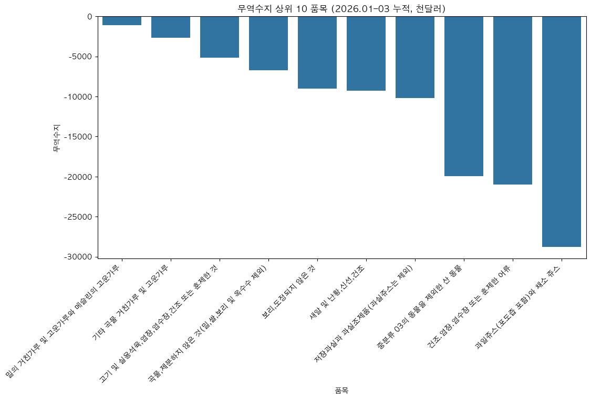
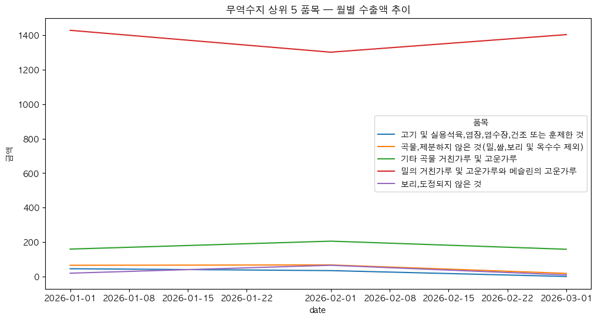
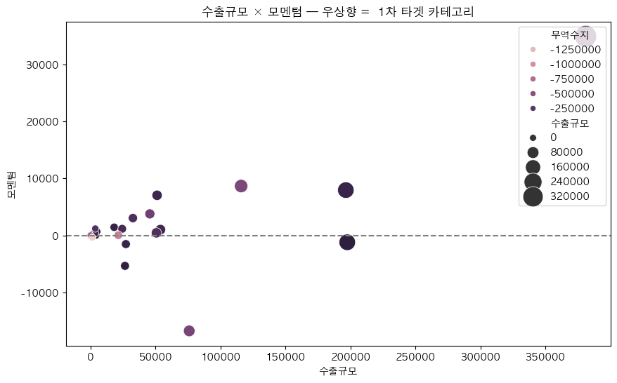
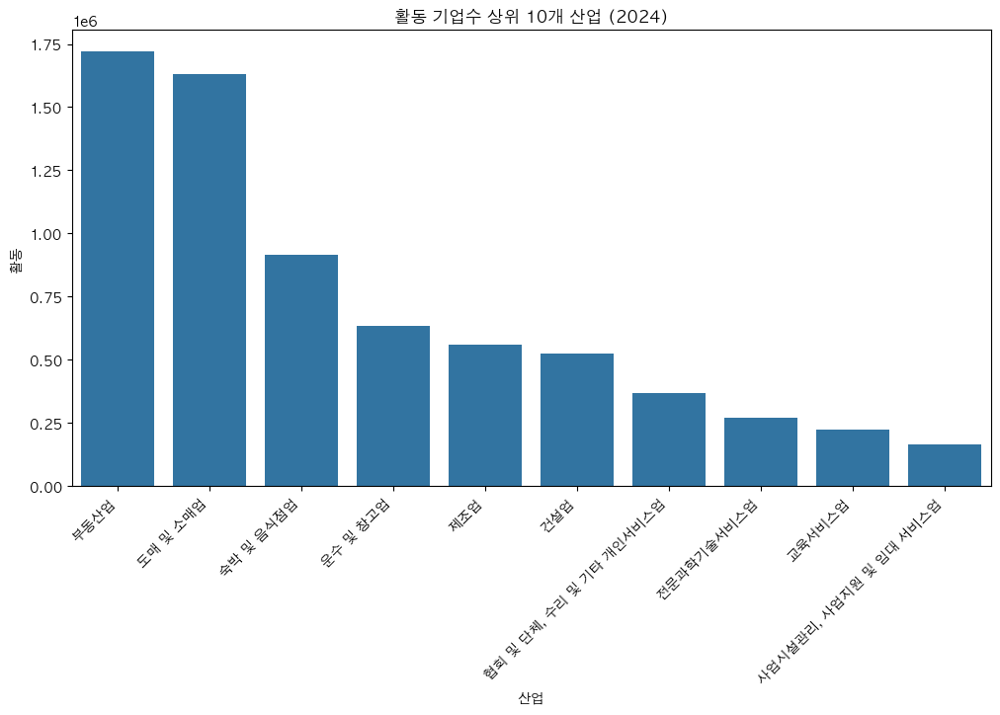

# GlobalGates — AI 발표 자료

> **"피드로 여는 기업용 비즈니스 소셜 마켓"**
> 한국 수출 구조의 다대다 미스매치를 해소하는 B2B 글로벌 판로 플랫폼

---

## 목차

1. [기획 배경 & 의도](#1-기획-배경--의도)
2. [데이터 분석 — KOSIS 4종 데이터 통합 분석](#2-데이터-분석--kosis-4종-데이터-통합-분석)
3. [머신러닝 (분류) — 채팅 욕설 분류기](#3-머신러닝-분류--채팅-욕설-분류기)
4. [머신러닝 (회귀) — 광고 노출 경과 시간 예측](#4-머신러닝-회귀--광고-노출-경과-시간-예측)
5. [머신러닝 (추천) — 커뮤니티 추천 시스템](#5-머신러닝-추천--커뮤니티-추천-시스템)
6. [LLM (RAG) — 화상회의 요약 챗봇](#6-llm-rag--화상회의-요약-챗봇)
7. [LLM (n8n) — 주간 개인화 리포트 자동 발송](#7-llm-n8n--주간-개인화-리포트-자동-발송)

---

## 1. 기획 배경 & 의도

### 한국 수출의 두 겹 양극화

한국 경제는 GDP의 약 **40%를 수출에 의존**하지만, 그 구조 안에는 두 겹의 양극화가 존재한다.

#### ① 기업 규모의 양극화

| 구분 | 비율 | 교역액 점유 |
|---|---|---|
| 중소기업 | 96.1% (93,912개사) | **16.6%** |
| 대기업 | 1.06% | **64.5%** |

- 1사당 평균 교역액 격차: **약 351배**
- 중소기업의 **60.2%가 매출 대비 수출 비중 1–24% 구간**에 9년째 정체

#### ② 시장 분포의 편중

- 상위 10개국 = 전체의 **71.1%**
- 중국·미국 두 나라 = **36.2%** (외생 충격에 취약)
- 그런데 실제 수출국은 **245개**, 연 1억 달러 이상 시장만 **112개**
- 노르웨이(+84.3%), 스위스(+81.6%), 대만(+45.4%), 홍콩(+43.4%) 등 **신흥 시장 102개의 기회 공간은 사실상 비어 있음**

### 본질 문제

> **"가장 많은 수의 중소기업(93,912개)이, 가장 많은 수의 신흥 시장(102개)에 도달하지 못하는 다대다 미스매치"**

이는 생산 역량의 문제가 아니라, **바이어를 만날 채널·시장 정보·신뢰 검증이라는 매개 인프라의 부재**다. KOTRA·해외전시회·무역사절단 같은 기존 채널은 1회성·고비용 모델이라 다대다 매칭을 감당할 수 없다.

### 플랫폼 설계 — 3-Layer 구조

| 레이어 | 역할 |
|---|---|
| **피드 레이어** | 동종 산업 수출 성공 사례·시장 시그널을 일상 노출 → 글로벌 감각 형성 |
| **소셜 그래프 레이어** | 산업·타깃 시장 단위로 바이어와 셀러를 다대다 연결 |
| **마켓 레이어** | 카탈로그·계약·결제 통합 신뢰 인프라로 1회성 거래 장벽 제거 |

### 성공 척도

단순 가입자 수가 아니라,
- 중소기업의 수출강도가 **1–24% → 25–49% 구간**으로 우상향한 비율
- 도달 시장이 **102개 신흥국**으로 확장된 정도

---

## 2. 데이터 분석 — KOSIS 4종 데이터 통합 분석

> **목표**: B2B 글로벌 판로 플랫폼이 1차 영입할 **품목·국가·기업군·산업**을 정량 근거로 도출

### 분석 축

| 축 | 데이터 | 도출 결과 |
|---|---|---|
| 품목 | 품목별 수출·수입액 (2026.01–03) | 무역수지·모멘텀 상위 카테고리 |
| 국가 | 국가별 수출입 (2022.01–2026.03) | 누적 수출 상위 10개국 |
| 기업규모 × 수출강도 | 2023년 단면 | 1사평균 교역액 격차 시각화 |
| 산업 | 산업별 활동/신생 (2024) | 영입 풀이 두꺼운 산업 |

### 핵심 코드 1 — 품목별 우선순위 (무역수지 × 모멘텀 × 규모)

```python
exp_df = ts_df[ts_df['구분'] == '수출']
imp_df = ts_df[ts_df['구분'] == '수입']

exp_sum = exp_df.groupby('품목')['금액'].sum()
imp_sum = imp_df.groupby('품목')['금액'].sum()
trade_balance = exp_sum - imp_sum

exp_jan = exp_df[exp_df['date'] == '2026-01-01'].set_index('품목')['금액']
exp_mar = exp_df[exp_df['date'] == '2026-03-01'].set_index('품목')['금액']
momentum = exp_mar - exp_jan

priority_df = pd.DataFrame({
    '수출규모': exp_sum,
    '무역수지': trade_balance,
    '모멘텀': momentum,
}).sort_values(['무역수지', '수출규모'], ascending=False)
```

**무역수지 상위 10 품목 (2026.01–03 누적)**



**무역수지 상위 5 품목 — 월별 수출액 추이**



**수출규모 × 모멘텀 — 우상향 = 1차 타겟 카테고리**



**누적 수출 상위 10개국 (2022.01–2026.03)**


### 핵심 코드 2 — 기업규모 × 수출강도 1사평균 (격차의 정량화)

```python
size_2023_df = size_long_df[
    (size_long_df["유형"] == "수출")
    & (size_long_df["연도"] == 2023)
    & (size_long_df["기업규모"].isin(["대기업", "중견기업", "중소기업"]))
    & (size_long_df["수출강도"].isin(["1-24%", "25-49%", "50-74%", "75% 이상"]))
].sort_values("1사평균_천달러", ascending=False)
```

**기업규모 × 수출강도별 1사평균 교역액 (2023, 천달러)**


→ 1사평균 최상위는 대기업 50–74% 구간(약 18.3억 천달러), 최하위는 중소기업 1–24% 구간(약 307 천달러). 모수는 중소기업 1–24%(56,578개)가 압도적이며 **1사평균 격차는 약 5,964배**. **플랫폼이 묶어줘야 할 가치가 가장 큰 셀.**

**수출강도 75% 이상 셀의 1사평균 추이 (2015–2023)** — hue=기업규모로 격차 구조 확인


### 핵심 코드 3 — 종합 산점도 (hue로 영입 풀 식별)

```python
plt.figure(figsize=(12, 7))
sns.scatterplot(
    data=industry_hue_df,
    x="활동", y="신생률",
    hue="산업", size="신생", sizes=(60, 600),
)
plt.axhline(industry_hue_df["신생률"].median(), color="gray", linestyle="--")
plt.axvline(industry_hue_df["활동"].median(), color="gray", linestyle="--")
plt.title("산업별 활동 기업수 × 신생률 (2024) — 우상단 = 1차 영입 풀")
```

**활동 기업수 상위 10개 산업 (2024)**



**산업별 활동 기업수 × 신생률 (2024) — hue=산업, size=신생**


→ 우상단(median 활동 × median 신생률 동시 통과) 산업이 **1차 영입 풀로 가장 두꺼움**. 도매·소매, 숙박·음식점, 전문과학기술서비스 등이 후보.

### 분석 결론

1. **국가** — 상위 10개국이 수출의 대부분. 1차 영입 품목의 판로는 이 시장으로 우선 연결.
2. **기업규모 × 수출강도** — 1사평균 격차가 가장 큰 셀(중소·1–24%)이 플랫폼 가치 제안의 핵심 타깃.
3. **산업** — 활동·신생률 동시 상위인 우상단 산업이 영입 풀로 가장 두꺼움.
4. **품목** — 무역수지 상위 품목 중 위 3개 조건과 매핑되는 품목이 1차 영입 카테고리 최종 후보.

---

## 3. 머신러닝 (분류) — 채팅 욕설 분류기

> **목표**: 커뮤니티/채팅 본문의 욕설 여부를 실시간 분류하여 모달/순화 정책에 연결
> **모델**: `CountVectorizer` + `MultinomialNB` (이진 분류)
> **데이터**: PostgreSQL `tbl_ml_profanity_dataset` (77,162행)

**Target 분포 (언더샘플링 전)** — abusive 50,825 / clean 26,337


### 과적합 억제 전략

1. **Kiwi 형태소 + 조사/어미 제거**로 어휘 폭발 차단
2. **StratifiedKFold(5)** — fold 별 클래스 비율 유지
3. **2-stage 튜닝**: RandomizedSearchCV (넓게) → GridSearchCV (좁게)
4. **3-seed 분산 체크** — 점수가 random_state 운빨인지 검증

### 핵심 코드 1 — 한국어 전처리 (Kiwi 조사 제거)

```python
kiwi = Kiwi()
josa_tags = ["JKS","JKC","JKO","JKG","JKB","JKV","JKQ","JX","JC",
             "EC","EF","EP","ETN","ETM"]

def remove_josa(sentence):
    result = []
    for token in kiwi.tokenize(sentence):
        if token.tag in josa_tags:
            continue
        result.append(token.lemma)
    return " ".join(result)
```

**예시**: `"개소리야 니가 빨갱이를 옹호하고..."` → `"개소리 이다 니 빨갱이 옹호 하..."`

### 핵심 코드 2 — 2-stage 튜닝 + 과적합 기준 모델 선택

```python
random_cv = RandomizedSearchCV(
    m_nb_pipe, param_distributions=random_params, n_iter=20,
    cv=skf, scoring=abusive_f1, n_jobs=-1, random_state=124,
)
random_cv.fit(X_train.values, y_train)

# best 주변 ±1 이웃으로 좁혀서 GridSearch
grid_cv = GridSearchCV(m_nb_pipe, param_grid=grid_params,
                      cv=skf, scoring=abusive_f1, n_jobs=-1)
grid_cv.fit(X_train.values, y_train)
```

### 핵심 코드 3 — Gap 기준 최종 모델 선택

```python
MAX_ALLOWED_GAP = 0.10  # train-test gap이 0.10 이내인 후보만 채택

eligible_models = model_compare_df[model_compare_df.gap <= MAX_ALLOWED_GAP]
final_model_row = eligible_models.sort_values(
    ["abusive_f1", "abusive_recall", "gap"],
    ascending=[False, False, True],
).iloc[0]
```

**후보 비교 결과**

| 모델 | train_acc | test_acc | gap | abusive_f1 |
|---|---|---|---|---|
| grid_best (min_df=1) | 0.966 | 0.798 | **0.168** ❌ | 0.806 |
| regularized_min_df2 | 0.894 | **0.805** | **0.089** ✅ | **0.807** |
| regularized_min_df3 | 0.867 | 0.803 | 0.063 ✅ | 0.805 |

→ **min_df=2 (정규화)** 채택. 과적합 억제하면서 abusive F1 유지.

### 3-seed Robustness 결과

| 지표 | 평균 ± std | 판정 |
|---|---|---|
| accuracy | 0.8023 ± 0.0034 | OK |
| precision | 0.7961 ± 0.0034 | OK |
| recall | 0.8128 ± 0.0042 | OK |
| f1 | 0.8043 ± 0.0035 | OK |
| ROC-AUC | 0.8767 ± 0.0020 | OK |

→ **std < 0.005** 모두 통과. 점수가 random_state에 의존하지 않음.

### 운영 threshold 정책 (모델 ≠ 의사결정)

```python
MODAL_THRESHOLD = 0.50    # 이 이상이면 모달로 경고
SOFTEN_THRESHOLD = 0.80   # 이 이상이면 강제 순화

def moderation_action(p_abusive):
    if p_abusive >= SOFTEN_THRESHOLD:
        return "soften_required"
    if p_abusive >= MODAL_THRESHOLD:
        return "show_modal"
    return "allow"
```

### 테스트셋 평가 — Confusion Matrix


- abusive 정밀도 0.7997 / 재현율 0.8140 / F1 0.8068
- clean 정밀도 0.8106 / 재현율 0.7961 / F1 0.8033

### 예측 데모

| 입력 | 예측 | p(abusive) |
|---|---|---|
| "안녕하세요 오늘 날씨 좋네요" | clean | 0.020 |
| "씨발 진짜 짜증나" | abusive | 0.596 |
| "이런 미친 새끼를 봤나" | abusive | **0.992** |
| "fuck this shit" | abusive | **0.992** |
| "장애인 새끼" | abusive | 0.985 |

---

## 4. 머신러닝 (회귀) — 광고 노출 경과 시간 예측

> **목표**: `payment_amount` (광고 결제 금액)으로 `elapsed_minutes` (노출 경과 시간) 예측
> **목적**: 광고주가 결제 시점에 노출 기간을 알 수 있도록
> **데이터**: 50,500행 / 1개 feature (정밀도 우선)

**EDA — payment_amount vs elapsed_minutes 산점도 & 타겟 분포**


→ 결제 금액과 노출 시간 사이에 강한 비선형 양의 상관(로그변환이 필요한 형태).

### 리팩토링 (Codex Review 반영) — 핵심 변경점

| Priority | 변경 |
|---|---|
| P1 | split **먼저** → 전처리는 Pipeline 안에서 train에만 fit (data leakage 차단) |
| P1 | 타겟 기반 IQR 필터링 제거 (production-valid 평가) |
| P1 | GridSearch scoring을 **RMSLE 기반**으로 통일 (objective 일치) |
| P2 | `TransformedTargetRegressor`로 log1p 변환 **일원화** |

### 핵심 코드 1 — Pipeline 일원화 (전처리 + 타겟 변환)

```python
def make_pipeline(model, scale=False):
    """median imputer + (선택적) scaler + 모델 + log1p 타겟 변환"""
    steps = [('impute', SimpleImputer(strategy='median'))]
    if scale:
        steps.append(('scale', StandardScaler()))
    steps.append(('model', model))
    inner = Pipeline(steps)
    return TransformedTargetRegressor(
        regressor=inner, func=np.log1p, inverse_func=np.expm1,
        check_inverse=False,
    )
```

### 핵심 코드 2 — 6개 모델 베이스라인 CV (RMSLE 기준)

```python
candidates = {
    'LinearRegression':          make_pipeline(LinearRegression(), scale=True),
    'DecisionTreeRegressor':     make_pipeline(DecisionTreeRegressor(...)),
    'RandomForestRegressor':     make_pipeline(RandomForestRegressor(...)),
    'GradientBoostingRegressor': make_pipeline(GradientBoostingRegressor(...)),
    'XGBRegressor':              make_pipeline(XGBRegressor(...)),
    'LGBMRegressor':             make_pipeline(LGBMRegressor(...)),
}

for name, est in candidates.items():
    neg_msle = cross_val_score(est, X_train, y_train, cv=3,
                                scoring='neg_mean_squared_log_error', n_jobs=-1)
    fold_rmsle = np.sqrt(-neg_msle)
```

**CV 결과 (RMSLE, 낮을수록 좋음)**

| 모델 | CV RMSLE |
|---|---|
| **GradientBoosting** | **0.1367** ⭐ |
| RandomForest | 0.1368 |
| XGBoost | 0.1370 |
| LGBM | 0.1431 |
| DecisionTree | 0.1537 |
| LinearRegression | 0.6106 |

### 핵심 코드 3 — RandomForest GridSearch + 최종 평가

```python
param_grid = {
    'regressor__model__n_estimators':    [120, 200, 300],
    'regressor__model__max_depth':       [6, 8],
    'regressor__model__min_samples_leaf':[3, 5, 10],
}

grid_rf = GridSearchCV(
    rf_pipe, param_grid=param_grid,
    scoring='neg_mean_squared_log_error',  # objective = RMSLE
    cv=3, n_jobs=-1,
)
grid_rf.fit(X_train, y_train)
```

### 최종 성능 (Locked Test Set, 1회 평가)

| Metric | Value |
|---|---|
| **R²** | **0.9465** |
| RMSE | 23,299.89 분 |
| RMSLE | 0.1305 |
| MAE | 12,995.75 분 |

→ R² ≈ 0.95로 단일 feature 회귀에서도 강한 예측력 확보.

**잔차 진단 — Actual vs Prediction / Residual vs payment_amount / Residual 분포**


- 좌: 정렬된 예측선이 실제 분포를 잘 따라감 (꼬리 구간만 외삽 한계)
- 중: 잔차가 0 주변에 대칭적으로 분포 (편향 없음)
- 우: 잔차 분포가 0을 중심으로 좁고 뾰족 → 대부분의 예측이 실제와 근접

---

## 5. 머신러닝 (추천) — 커뮤니티 추천 시스템

> **목표**: 사용자가 어떤 커뮤니티에 가입하면, **제목·태그·설명** 기반으로 비슷한 커뮤니티 Top-N 추천
> **방법**: CountVectorizer / TfidfVectorizer + Cosine Similarity
> **데이터**: `tbl_community_dataset` (시드 119건 + 템플릿 증강 → 총 320건, 41개 카테고리)

### 핵심 코드 1 — 문서 결합 + Kiwi 전처리

```python
pre_df = (
    df['community_name'].fillna('') + ' ' +
    df['tags'].fillna('').str.replace(',', ' ') + ' ' +
    df['description'].fillna('')
).to_frame('contents')

# 형태소 분석으로 조사 제거 → 의미 단위 매칭 강화
pre_df['contents_kiwi'] = pre_df['contents'].apply(remove_josa)
```

### 핵심 코드 2 — TF-IDF + 코사인 유사도

```python
from sklearn.feature_extraction.text import TfidfVectorizer
from sklearn.metrics.pairwise import cosine_similarity

tfidf_v = TfidfVectorizer()
tfidf_matrix = tfidf_v.fit_transform(pre_df['contents_kiwi'])
cosine_tfidf = cosine_similarity(tfidf_matrix)
# tfidf_matrix: (320, V),  cosine_tfidf: (320, 320)
```

### 핵심 코드 3 — Top-N 추천 함수

```python
def recommend_similar_communities(community_id, top_n=5, method='tfidf'):
    sim_matrix = cosine_tfidf if method == 'tfidf' else cosine_count
    idx = df.index[df['id'] == community_id][0]
    sims = sim_matrix[idx]

    # 자기 자신 제외 후 Top-N
    order = np.argsort(sims)[::-1]
    order = [i for i in order if i != idx][:top_n]

    result = df.iloc[order][['id', 'community_name', 'tags', 'category_id']].copy()
    result['similarity'] = sims[order].round(4)
    result['category'] = result['category_id'].map(CATEGORY_NAMES)
    return result.reset_index(drop=True)
```

### CountVectorizer vs TfidfVectorizer

| 방식 | 가중치 정책 |
|---|---|
| **CountVectorizer** | 단순 단어 빈도 (자주 등장하는 일반어도 동일하게 반영) |
| **TfidfVectorizer** ⭐ | 흔한 단어는 깎고 변별력 있는 단어를 강조 |

→ 운영에서는 `method='tfidf'` 기본값 사용.

### 활용 시나리오

플랫폼에서 신규 사용자가 "수출 첫걸음 입문자방"에 가입 → TF-IDF Top-5로 결이 비슷한 커뮤니티(예: "FTA 활용 입문방", "수출 서류 작성 스터디" 등)를 즉시 추천 → **소셜 그래프 레이어의 콜드 스타트 해결**.

---

## 6. LLM (RAG) — 화상회의 요약 챗봇

> **목표**: 사용자가 참여한 화상회의 요약을 LLM이 읽고, "지난 회의에서 합의한 단가가 얼마였지?" 같은 자연어 질문에 정확히 답
> **스택**: LangChain + FAISS + `jhgan/ko-sbert-nli` + Redis Semantic Cache + GPT
> **권한 모델**: `member_id`가 caller/receiver인 회의 요약만 검색·캐시

### 아키텍처

```
사용자 질문
    ↓
[1] 권한 검증 (DB)
    ↓
[2] Redis Semantic Cache 조회 (scope = member_X__video_session_Y)
    ↓ (miss)
[3] FAISS 벡터 검색 (video_session_id metadata filter)
    ↓
[4] PromptTemplate + GPT 호출
    ↓
[5] 결과 캐싱 후 반환
```

### 핵심 코드 1 — Semantic Cache (질문 단위, scope 분리)

**왜 LangChain 전역 `RedisSemanticCache`를 끄는가?**
RAG 최종 프롬프트에는 긴 공통 Context가 들어가서 **다른 질문도 같은 답변으로 캐시 히트**할 위험이 있다. 그래서 `member_id + video_session_id + question`을 임베딩한 답변 캐시를 RAG 앞단에 둔다.

```python
def build_cache_query(question, video_session_id=None, member_id=None):
    scope = build_cache_scope(video_session_id, member_id)
    # scope를 질문 앞에 붙여서 같은 질문이라도 다른 사용자/회의면 다른 벡터로 임베딩
    return f"{scope}\n질문: {question}"

def lookup_answer_cache(question, video_session_id=None, member_id=None):
    cache_query = build_cache_query(question, video_session_id, member_id)
    expected_scope = build_cache_scope(video_session_id, member_id)
    vector_db = get_answer_cache_store()
    # scope tag로 먼저 제한 → 다른 사용자/회의 캐시 혼입 방지
    scope_filter = RedisTag("scope") == expected_scope
    results = vector_db.similarity_search_with_score(cache_query, k=1, filter=scope_filter)
    # ...
    if score <= ANSWER_CACHE_SCORE_THRESHOLD and cached_scope == expected_scope:
        return {"answer": ..., "score": score, ...}
```

### 핵심 코드 2 — video_session_id metadata filter로 검색 범위 제한

```python
def retrieve_documents(question, video_session_id=None, k=4):
    search_kwargs = {"k": k}
    if video_session_id is not None:
        # 특정 회의만 물어볼 때는 해당 회의 청크만 검색
        search_kwargs["filter"] = {"video_session_id": int(video_session_id)}
    return vectorstore.similarity_search(question, **search_kwargs)
```

### 핵심 코드 3 — LCEL 비동기 체인 (FastAPI 재사용)

```python
chain = (
    {"context":  RunnableLambda(_context_from_input),
     "question": RunnableLambda(_question_from_input)}
    | prompt
    | llm
    | StrOutputParser()
)

async def ask_video_chat_rag(question, video_session_id=None, member_id=None):
    member_id = require_member_id(member_id)
    assert_video_session_access(member_id, video_session_id)   # 1) 권한 검증

    cached = lookup_answer_cache(question, video_session_id, member_id)
    if cached:
        return {"answer": cached["answer"], "cache_hit": True, ...}

    answer = await chain.ainvoke(payload)                       # 2) RAG 호출
    store_answer_cache(question, answer, video_session_id, member_id)
    return {"answer": answer, "cache_hit": False, ...}
```

### 핵심 코드 4 — Prompt (Context 밖 정보 금지)

```python
prompt = PromptTemplate.from_template(
    """귀하는 제공된 참고 문헌을 바탕으로 질문에 답하는 정보 분석 전문가입니다.
    답변 시 반드시 제시된 문맥(Context) 내의 정보만을 활용하십시오.
    만약 주어진 자료만으로 답변이 어렵다면, 추측하지 말고
    '제공된 정보로는 확인이 불가능하다'고 명확히 밝히십시오.

    #Context: {context}
    #Question: {question}
    #Answer:"""
)
```

### 검증 결과

| # | 질문 | cache_hit | 소요 |
|---|---|---|---|
| 1 | "단가 협상에서 합의한 단가는 얼마야?" | False (LLM) | **1.37초** |
| 2 | (1과 동일 질문) | **True** (score=0.00) | **0.03초** |
| 3 | "협상한 단가가 얼마였지?" *(유사질문)* | **True** (score=0.03) | **0.03초** |
| 4 | "화성 탐사 계획에 대해 알려줘" *(무관)* | False → "확인이 불가능하다" | 1.44초 |
| 5 | 권한 없는 `video_session_id=2` | **PermissionError 차단** | — |

→ Semantic cache hit 시 **약 45배 응답 속도 향상**, scope 분리로 사용자 간 정보 누출 차단, Context 밖 질문은 환각 없이 거부.

---

## 7. LLM (n8n) — 주간 개인화 리포트 자동 발송

> **목표**: 매주 월요일 09:00, 지난 7일간 좋아요한 활동이 있는 회원에게 **개인 맞춤 큐레이션 이메일** 자동 발송
> **스택**: n8n + PostgreSQL + OpenAI (GPT-5.4-nano) + Gmail

### 워크플로우 다이어그램

```
[Schedule Trigger (Mon 09:00)]  or  [Webhook (수동 트리거)]
                  ↓
        [Get site context]            ← 전체 인기 글/해시태그 (executeOnce)
                  ↓
        [Get target members]          ← 지난 7일 좋아요 활동 회원 조회
                  ↓
   ┌──────[Loop Over Members]──────┐
   ↓                                ↑
[Get user data]                     │
   ↓                                │
[Build prompt input]                │
   ↓                                │
[Generate personal report] (OpenAI) │
   ↓                                │
[Format email] (HTML escape)        │
   ↓                                │
[Skip 체크]                          │
   ↓                                │
[Rate limit 1s] → [Send Gmail] ─────┘
```

### 핵심 1 — 사용자별 개인화 데이터를 한 쿼리로

5개 데이터(좋아요 글 / Top 해시태그 / 추천 글 / 추천 팔로우 / 추천 커뮤니티)를 **JSON 컬럼 5개로 묶어 1번의 round-trip**으로 가져옴.

```sql
with
liked_posts_raw as (
  select p.id, p.title, p.content, p.created_datetime, pl.created_datetime as liked_at
  from tbl_post_like pl
  join tbl_post p on p.id = pl.post_id
  where pl.member_id = $1 and pl.created_datetime >= now() - interval '7 days'
  order by pl.created_datetime desc limit 30
),
user_hashtags_raw as ( /* 지난 30일 Top 5 해시태그 */ ),
rec_posts_raw as ( /* 안 본 인기 글 Top 5 */ ),
rec_follows_raw as ( /* 자주 반응했지만 안 팔로우한 작성자 Top 3 */ ),
rec_communities_raw as ( /* 관심사 카테고리의 미가입 커뮤니티 Top 3 */ )
select
  coalesce((select json_agg(row_to_json(t)) from liked_posts_raw t),   '[]'::json) as liked_posts,
  coalesce((select json_agg(row_to_json(t)) from user_hashtags_raw t), '[]'::json) as user_hashtags,
  coalesce((select json_agg(row_to_json(t)) from rec_posts_raw t),     '[]'::json) as rec_posts,
  coalesce((select json_agg(row_to_json(t)) from rec_follows_raw t),   '[]'::json) as rec_follows,
  coalesce((select json_agg(row_to_json(t)) from rec_communities_raw t),'[]'::json) as rec_communities;
```

### 핵심 2 — Build prompt input (실패 회원은 _skip 마커)

```javascript
const member = $('Loop Over Members').item.json;
const u      = $input.first().json;
const site   = $('Get site context').item.json;

// Get user data가 실패한 경우 (continueOnFail 통과 데이터)
if (u.error || (!u.liked_posts && !u.user_hashtags)) {
  return [{ json: { ..., _skip: true, _reason: 'get_user_data_failed' } }];
}

// 토큰 절약: 좋아요 글 본문 600자 컷
let likedText = likedPosts.map((row, i) => {
  const content = (row.content || '').toString().slice(0, 600);
  return `[${i + 1}] 제목: ${row.title}\n내용: ${content}`;
}).join('\n---\n').replaceAll('#', '').replaceAll('*', '');
```

### 핵심 3 — 큐레이션 프롬프트 (개인화 강제)

```
너는 GlobalGates 커뮤니티의 전속 큐레이터다. 단 한 사람,
{{ $json.nickname }}님 한 분만을 위한 주간 큐레이션 메일을 작성한다.
받는 사람이 "이건 다른 누구도 아닌 내 메일이다"라고 느끼게 만드는 것이 목표다.

[입력 데이터]
A) 지난 7일 좋아요한 글 ...
B) Top 해시태그 (지난 30일) ...
C) 사이트 전체 인기 해시태그 ...
D) 사이트 전체 인기 글 ...
E) 추천 후보 (글/팔로우/커뮤니티) ...

[작성 가이드 — 4 섹션]
▶ 이번 주 {{ nickname }}님은 (3~4문장, 키워드 1~2개 인용)
▶ 이번 주 커뮤니티에서 일어난 일 (불릿 3개, 숫자 인용 필수)
▶ {{ nickname }}님께 어울릴 것 같아요 (불릿 3개, 이유 명시)
▶ 한 줄 응원 (관심사 결을 살린 마무리)

[엄격 규칙]
1) 입력 데이터에 없는 사실/숫자/인물/제목을 절대 지어내지 마라
2) 광고·매수매도·투자 조언 금지
3) 마크다운(#, *, `) 금지
4) 1,500~2,000자 / "{{ nickname }}님"을 4번 이상 호명
```

### 핵심 4 — Format email (XSS 방지 HTML 이스케이프)

```javascript
const escapeHtml = (s) => String(s)
  .replaceAll('&', '&amp;').replaceAll('<', '&lt;').replaceAll('>', '&gt;')
  .replaceAll('"', '&quot;').replaceAll("'", '&#39;');

const safeNickname = escapeHtml(member.nickname);
const safeText     = escapeHtml(text);

const html = `
<div style="font-family:Apple SD Gothic Neo,...;max-width:640px">
  <h2 style="color:#7c5cff">${safeNickname}님의 주간 리포트</h2>
  <p style="color:#666;font-size:13px">지난 7일 좋아요 ${member.post_count}건 기반 · 개인 맞춤 분석</p>
  <pre style="white-space:pre-wrap;...">${safeText}</pre>
</div>`;
```

### 운영 안정성 장치

| 노드 | 역할 |
|---|---|
| `Get site context` | `executeOnce: true` — 회원 수만큼 반복 안 함 |
| `Get user data` | `continueOnFail: true` — 한 회원 실패해도 전체 중단 안 함 |
| `Build prompt input` | `_skip` 마커로 실패 회원 격리 |
| `Skip 체크` (IF 노드) | `_skip=true`면 메일 발송 건너뛰고 다음 회원으로 |
| `Rate limit (1s)` | Gmail API 분당 한도 회피 |
| `Webhook` | 즉시 응답(202) 반환 + 비동기 처리 |

---

## AI 파트 전체 요약

| 파트 | 핵심 모델/기술 | 핵심 지표 / 결과 |
|---|---|---|
| 데이터 분석 | pandas + seaborn (4종 데이터 통합) | 1사평균 격차 5,964배, 영입 풀 우상단 산업 식별 |
| ML 분류 | MultinomialNB + Kiwi + 2-stage 튜닝 | F1 0.807, gap 0.089, 3-seed std < 0.005 |
| ML 회귀 | RandomForest + log1p 타겟 변환 | **R² 0.9465**, RMSLE 0.1305 |
| ML 추천 | TF-IDF + Cosine Similarity | 320개 커뮤니티 콜드스타트 추천 |
| LLM RAG | LangChain + FAISS + Redis Semantic Cache | 캐시 hit 시 **45배 가속**, scope 권한 분리 |
| LLM n8n | n8n + GPT-5.4-nano + Gmail | 주간 자동 발송, 5종 데이터 1쿼리 통합 |

> **공통 설계 원칙**: 각 모델/파이프라인은 단순 정확도가 아니라 **플랫폼 운영 시점의 의사결정**(영입 카테고리, 모달 정책, 추천, 권한 분리, 발송 안정성)에 연결되도록 설계했다.
